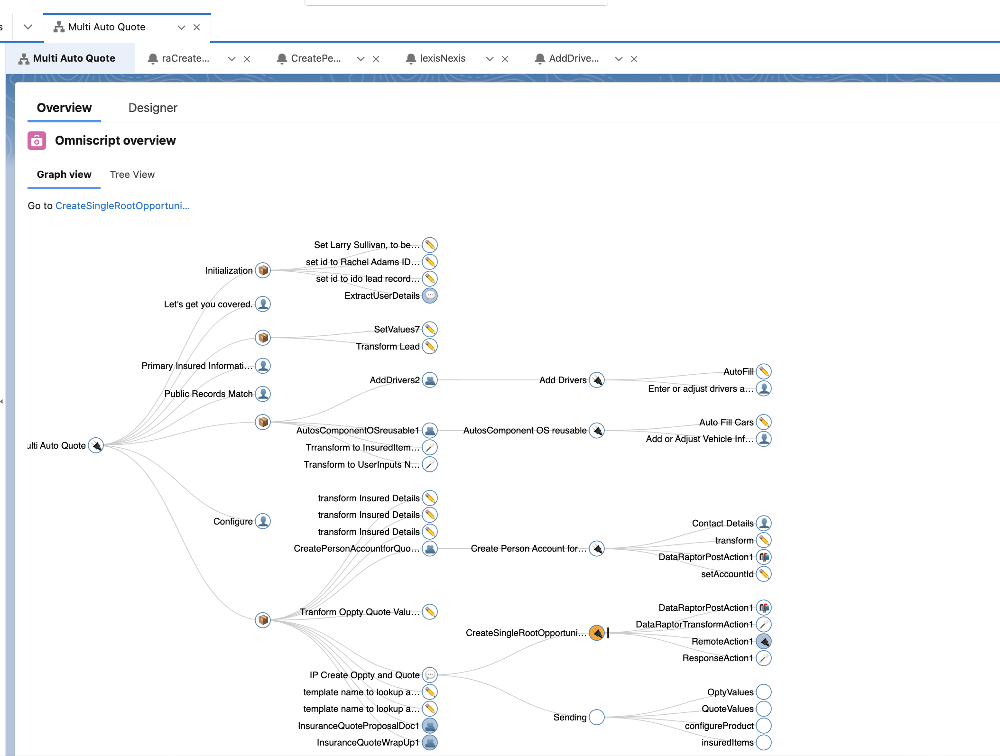

# Salesforce Industry Explorer

## Explore Omnistudio
Whereas Salesforce core provide a lot of tooling to help analyze your org, it is rather difficult to get a clear picture about what was going on with the omniscripts deployed:
* No overview of what is being called in what order without executing the process
* Omnistudio Screens are more intended for edition rather than view: it means that input fields are disabled but the screen is not appropriate for somebody trying to understand what is going on.
* No option to visualize the dependencies between the components
* Lack of interface between the components: how do I know what is the expected input and output

## Proposed Solution

The proposed solution is using a D3 collapsible tree that can be embedded within your lightning record page:

